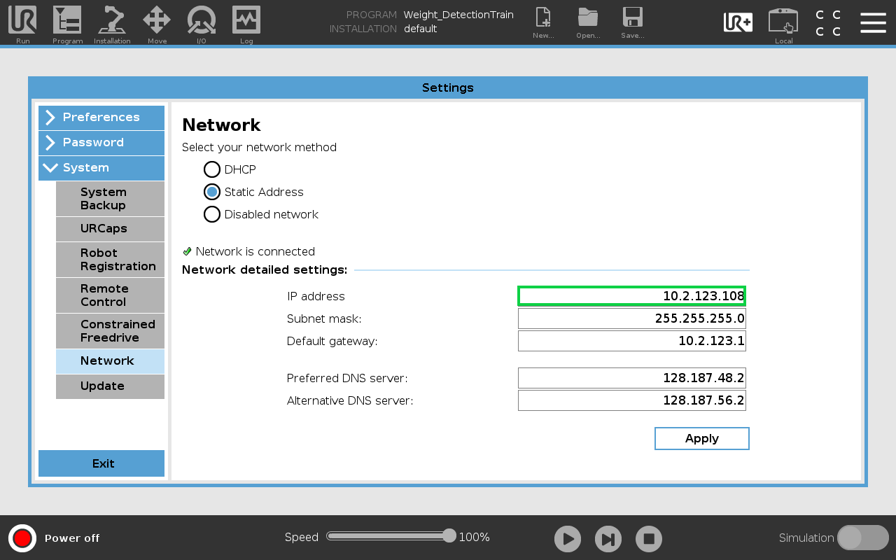

# UR3-Analytics

Objective: Demonstrate the usage of Thingworx Analytics by using it to determine the weight of an object that a UR3 robot is holding.
In this exercise, you will perform:

1. [Setup](https://github.com/PTC-Education/UR3-Analytics#Setup) - Download and configure files and devices
2. [Data Collection](https://github.com/PTC-Education/UR3-Analytics#Data-Collection) - Collect joint amperage data from the UR3
3. [Modeling](https://github.com/PTC-Education/UR3-Analytics#Modeling) - Create a machine learning model
4. [Deployment](https://github.com/PTC-Education/UR3-Analytics#Deployment) - Perform automated real time predicitons

## Setup

<li>Getting Started</li>

To do this exercise, you need:
    <ol>
    <li>Thingworx Kepware installed.</li>
    <li>Access to a Thingworx instance.</li>
    <li>A UR robot</li>
    </ol>
    
Please download the folder, [main](main).

<li>Kepware Configuration</li>

With Kepware installed, open the file called **UR3_kepwareConfig.opf**. This configuration file is setup to communicate with the UR3 but you will need to change a few things:
    <ol>
    <li>The Thingworx Host address.</li>
    <li>The Thingworx port number.</li>
    <li>The application key.</li>
    <li>The device ID or ip address.</li>
    </ol>
    
The Thingworx host address and port is the URL used to reach the server. An example of a URL is shown below.

>http://servername:PORT/Thingworx/Composer

In the case above, the host is **servername** and the port is **PORT**. 

<li>Thingworx Composer</li>

Navigate to your Thingworx composer on your browser. Click **Import/Export** and select the file, **UR3-project.twx**. 

Click **Import**.

This file contains the **UR3-analytics** project. Navigate to the project in in composer by searching for it in the search bar.

Confirm that each of the entities shown in the image below are present.

Create an Application Key in Thingworx

 

You must create an application key to give the Kepware server authorization to communicate with the Thingworx server. Navigate to your Thingworx composer on your browser.

1. Select New and type 'app' and select **application key**

2. Fill out the app key general information 
    A. Name the app key 'UR3-appkey' 
    B. Set the project to 'UR3-Analytics' 
    C. Under 'User Name Reference', select your own Thingworx username. 

3. Set the expiration date for a future date.

4. Select **Save** and the application key will appear under **Key ID**. Select the copy button to the right of the **Key ID** to copy it to the clipboard.

Right click **Project** and select **Properties**>**Thingworx**. Input your host address and port number into the **Host** and **Port** fields. Paste your application key into the **application key** field.

Click **Apply** and **OK**.

On the UR3 teaching pendant, find the ip address of your UR3 by selecting **Hamburger Menu**>**Settings**>**System**>**Network**. Choose **Static Address** as the network method. Choose an ip address and subnet mask which will allow the UR3 to be on the same network as your computer running the Kepware server.

In the Kepware configuration, Under **Project**>**Connectivity**>**UR_Channel**, Right click **UR3** and select **Properties**>**General**. Enter the ip address into the **ID** field.

<li>UR Teaching Pendant</li>

Create a new Modbus client by selecting **Installation**>**Fieldbus**>**MODBUS**>**Add MODBUS Unit**. Enter the same ip address into the **IP Address** field. Add the following modbus signals by selecting **Add New Signal**.

|   Type	        |   Address |   Name	        |
|---	            |---	    |---	            |
|   Register Input	|   128	    |   TWX_Weight	    |
|   Register Input	|   129	    |   AnalysisDone    |
|   Register Output	|   130 	|   ObjectWeight    |
|   Register Output	|   131 	|   position	    |
|   Register Output	|   132 	|   SortingDone	    |

## Data Collection

UR3 Setup

 
  
  <ul>
<li>Setup Modbus profile on teaching pendant</li>
<li>Download UR programs</li>
<li>Get IP address for Kepware</li>
    For this connection to work, you will need to change the IP address of the target device in the Kepware settings to the IP address of your UR3 robot. The IP address of your robot is found on the teaching pendant under **Hamburger menu>Settings>Network**.  
</ul>
  
  

Thingworx Setup

 
  We will read and send data bewteen the UR3 and Thingworx with Kepware. 
  First download the **Remote Thing** file and the **Gateway Thing** file provided below and import it into your Thingworx instance. 
  
  > [UR3_thing](https://www.google.com) (Remote Thing)
  > [UR3_gateway](https://www.google.com) (Gateway)
  
  In Thingworx, select **Import/Export** and import the UR3_Thing and the UR3_gateway 

Download the Kepware configuration file shown below. 
  
  > [UR3_kepwareConfig.opf](https://www.google.com)
  
  
 Inside of Kepware, right click on UR3 and select properties. Under **General>ID**, input the IP address of your UR3. 
  
  Create an app key in Thingworx and input the app key into Kepware. 
  
  Ensure all thing properties are good quality in Thingworx. 
 
  
  

  
  

Onshape Model data

 
  
  Create a digital twin in Onshape which mirrors the robots positions.
  
  In addition to adding joint data to the model, we will add object distance from base. 
  
  

  
  

Collect Data

 
  
Have 5 different weights on hand for the robot to hold. Weights cannot exceed the max weight specified by the robot. 
  
  Run the program called, "weight_training," from UR teaching pendant. 
  The teaching pendant will require user input throughout the program. When the program asks to place a weight into the robot gripper, hold the object in between the jaws and press continue on the pendant. The program will wait 1 second and then close the gripper. 
  
  It will then perform the movements to generate the data needed to train the machine learning model. 
  
  Run the program with each of the 5 objects. 
  
  

  

## Modeling
  

Export and clean Data

 
  
Export the data into a CSV. 
Open the CSV file in Micosoft Excel 
Delete bad data 
  
  

  
  

Thingworx Analytics

 
  
Upload data into Thingworx analytics. 
Create model using default settings. 

  
  

  
  ## Deployment
  
   

Connect inputs and output to thing properties

 
  
Connect predictions to UR3_thing properties. 
  
  

  
  

Testing

 
  
Run program called, "weight_detection." 
Predicted values will appear on teaching pendant and in Thingworx. 
Test the model by giving robot unseen weights. 
  
  

