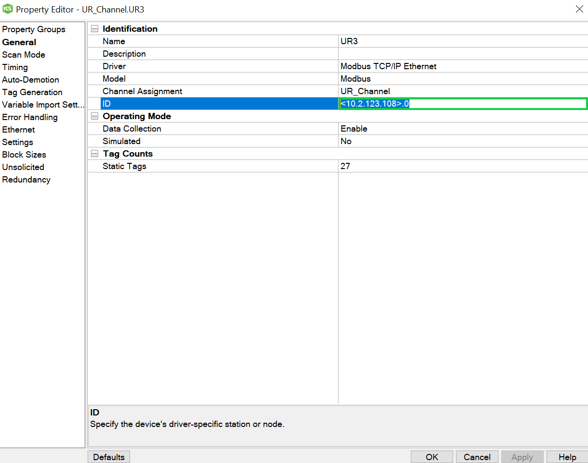

# UR3-Analytics

Objective: Demonstrate the usage of Thingworx Analytics by using it to determine the weight of an object that a UR3 robot is holding.
In this exercise, you will perform:

1. [Setup](https://github.com/PTC-Education/UR3-Analytics#Setup) - Download and configure files and devices
2. [Data Collection](https://github.com/PTC-Education/UR3-Analytics#Data-Collection) - Collect joint amperage data from the UR3
3. [Modeling](https://github.com/PTC-Education/UR3-Analytics#Modeling) - Create a machine learning model
4. [Deployment](https://github.com/PTC-Education/UR3-Analytics#Deployment) - Perform automated real time predicitons

## Setup

### Getting Started

To do this exercise, you need:
    <ol>
    <li>Thingworx Kepware installed.</li>
    <li>Access to a Thingworx 9</li>
    <li>A UR robot</li>
    <li>A USB drive</li>
    </ol>
    
Please download the folder, [main](main).

This guide assumes basic Universal robot operation knowledge.

### Kepware Configuration

With Kepware installed, open the file called **UR3_kepwareConfig.opf**. This configuration file is setup to communicate with the UR3 but you will need to change a few things. We will find each item and then show you how add them to the Kepware configuration. 

The Thingworx Host address and port number

 
    
The Thingworx host address and port is the URL used to reach the server. An example of a URL is shown below.

>http://servername:PORT/Thingworx/Composer

In the case above, the host is **servername** and the port is **PORT**. (If a port is not shown in the URL, the default is 443.) 

    

The application key

 

You must create an application key to give the Kepware server authorization to communicate with the Thingworx server. Navigate to your Thingworx composer on your browser.

1. Select New and type 'app' and select **application key**

2. Fill out the app key general information 
      A. Name the app key 'UR3-appkey' 
      B. Set the project to 'UR3-Analytics' 
      C. Under 'User Name Reference', select your own Thingworx username. 

3. Set the expiration date for a future date.

4. Select **Save** and the application key will appear under **Key ID**. Select the copy button to the right of the **Key ID** to copy it to the clipboard.

The device ID or ip address

 

Connect your UR3 controller to your local network with an ethernet cable. On the UR3 teaching pendant, find the ip address of your UR3 by selecting **Hamburger Menu**>**Settings**>**System**>**Network**. Choose **DHCP** and once the robot is automatically assigned an ip address, select **Static Address** as the network method. This will keep the ip address from ever changing. The computer running your Kepware server should be on the same network as the UR3.

Now that you have found the items we need to add to the kepware configuration, lets go ahead and add them. Right click **Project** and select **Properties**>**Thingworx**. Input your host address and port number into the **Host** and **Port** fields. Paste your application key into the **application key** field.

Click **Apply** and **OK**.

In the Kepware configuration, Under **Project**>**Connectivity**>**UR_Channel**, Right click **UR3** and select **Properties**>**General**. Enter the ip address into the **ID** field.

*************************************************************

### Import UR3-project to Thingworx

Navigate to your Thingworx composer on your browser. Click **Import/Export** and and browse for the file, **UR3-project.twx** on your hardrive. 

After you select you file, click **Import**.

This file contains the **UR3-analytics** project. Navigate to the project in in composer by searching for it in the search bar.

Confirm that each of the entities shown in the image below are present. 

***************************************************************

### UR Teaching Pendant Setup

Create a new Modbus client by selecting **Installation**>**Fieldbus**>**MODBUS**>**Add MODBUS Unit**. Enter the same ip address into the **IP Address** field. Add the following modbus signals by selecting **Add New Signal**.

|   Type	        |   Address |   Name	        |
|---	            |---	    |---	            |
|   Register Input	|   128	    |   TWX_Weight	    |
|   Register Input	|   129	    |   AnalysisDone    |
|   Register Output	|   130 	|   ObjectWeight    |
|   Register Output	|   131 	|   position	    |
|   Register Output	|   132 	|   SortingDone	    |

Download the following programs to a USB drive from your computer:

[Weight_Train.urp](https://github.com/PTC-Education/UR3-Analytics/raw/main/main/Weight_Train.urp)

[Weight_Detection.urp](https://github.com/PTC-Education/UR3-Analytics/raw/main/main/Weight_Detection.urp)

Insert the USB drive into the teaching pendant, and save the programs.

******************************************************************************************

## UR3 Data Collection

<ol>
    <li>On the teaching pendant, load the Weight_training.urp program.</li>
    <li>Navigate to the mashup in Thingworx composer by searching, UR3-analyticsmashup. This mashup will be useful during the next steps. Select View Mashup.</li>
    <li>With 5 well distributed weights in the range of 0-6.6 lbs nearby, press the play button to run the program.</li>
    <li>Follow the prompts on the teaching pendant:
<ul>
    <li>Input object weight in lbs. (Up to 3 decimal places. Ex: 1.542 lbs).</li>
    <li>When prompted, hold object inside the gripper while you simultaneously press continue. The gripper will closer, holding the object.</li>
    <li>Weight for the program to finish, select yes to remove object and the program will loop, asking for a new object.</li>
    <li>Repeat this until you have gven the robot at least 5 objects</li>
</ul>
</li>
</ol>

  
## Modeling

### Data Understanding
In Thingworx, you can log properties in a remote thing by selecting the property and checking the 'logged' box. In order to log properties to a value stream, the remote thing must have a value stream entity specified, in this case, UR3-valuestream is selected. The property value is logged to the value stream whenever the value changes.

Kepware is set to scan for new property values every 10 ms, which can lead to many values being logged. In our case, we are only interested in certain wos of data, and not every single new value that logs to the value stream.

Though we are logging 7 properties with each data change, we will only use a small portion of this data to make the prediction. The data that will help us create the best machine learning model we can will match the following conditions:
<ul>
    <li>The robot must be in a specific position.
        <ul>
            <li>We want to isolate the relationship between the joint amperage and the weight of the object.</li>
            <li>The robot program sets the General_position property to 1 when in position and 0 when not in the position.</li>
        </ul>
    </li>
    <li>Only 4 of the 6 joints are meaningful.
            <ul>
            <li>In the chosen robot position, joints 1 and 6 are not helpful because their amperage hardly changes with varying payloads.</li>
        </ul>
    </li>
    <li>Negative amperage values are determined by substracting the value itself from 65535.
            <ul>
            <li>In the position we chose, the amperage is not negative or close to zero. Any values greater than 60000 should be irrelevant in this situation.</li>
        </ul>
    </li>
    <li>Velocity of all joints must be zero.
            <ul>
            <li>We made a decision to predict the weight while the robot was still. This makes data captured with the robot moving irrelevant.</li>
            <li>Within UR3_remotething, a subscription sets the robot_moving boolean property to true or false, based on the joint velocity values</li>
        </ul>
    </li>
</ul>

A service called **QueryPropertyHistory** retrieves the logged property data. Since we only want certain data, we defined a query parameter which filters out the unwanted data when running this service. This query is a property in UR3-remotething called **queryFilter**. This query filters the data according to the cases presented above.

To train a machine learning model, we will use the Thingworx Analytics REST API services. The model training service will use the data retrieved after running the QueryPropertyHistory service with the aforementioned query as a parameter. We specify multiple linear regresison so that we can predict weights that the robot has not held before.

### Train Model

If you have trained 5 wieghts, you should see at least 5 clusters of points on the line chart in the UR3-analyticsmashup. Confirm this before continuing on. It may look similar to the image below.

If you have confirmed that you have successfully logged the data of at least 5 weights in a well distrubted range of 0-6.6 lbs, you can now select **Train Model** in the UR3-analyticsmashup. A JobId is returned from the service you executed when clicking that button and a new jobId string is saved to the **id** property. (This **id** is used in the service which performs the real time scoring.) 

## Deployment
     
   <ol>
    <li>On the teaching pendant, load the Weight_Detection.urp program.</li>
    <li>Navigate to the mashup in Thingworx composer by searching, 'UR3-analyticsmashup'. This mashup will be useful during the next steps. Select View Mashup.</li>
    <li>With 5 weights in the range of 0-6.6 lbs nearby (these should be different weights than what you used in Data Collection), press the play button to run the program.</li>
    <li>Follow the prompts on the teaching pendant:
<ul>
    <li>When prompted, hold object inside the gripper while you simultaneously press continue. The gripper will closer, holding the object</li>
    <li>The robot will move to the same position as it did when training, but this time it will be detecting the weight. The weight will appear on the teaching pendant screen as a popup after a few seconds.</li>
    <li>The robot will sort the object by weight, placing it into 1 of 3 piles. Once above the pile, the robot will move down slowly until it makes contact. Upon making contact, the robot will release the object.</li>
    <li>On completion of the sorting, select 'yes' to remove object and the program will loop, asking for a new object.</li>
    <li>Repeat this as many times as you want. It might be interesting to compare the accuracy of the predicitons to the actual object weight.</li>
</ul>
</li>
</ol>
  
